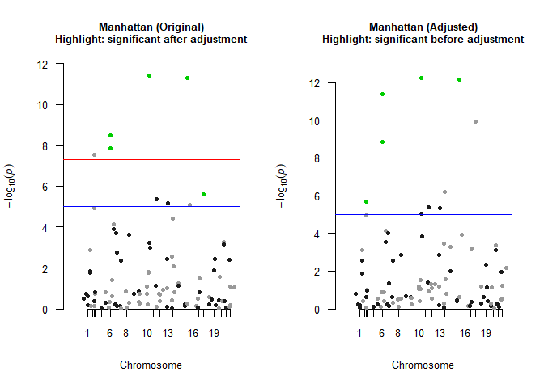

<!-- README.md is generated from README.Rmd. Please edit that file -->

# LOVAGWAS

<!-- badges: start -->
<!-- badges: end -->

The goal of LOVAGWAS is to adjust GWAS SNP marginal effect sizes to
estimate the direct genetic effect using the causal relationship between
the outcome and exposures estimated by Multivariable Mendelian
Randomization approach

## Installation

You can install the development version of LOVAGWAS from
[GitHub](https://github.com/) with:

``` r
# install.packages("pak")
pak::pak("lamessad/LOVAGWAS")
```

## Preparing Input Data

Before applying **`LOVAGWAS`**, all GWAS summary statistics (exposures
and outcome) must be: **1. Harmonized to the same reference panel (e.g.,
1000 Genomes EUR). **2. Restricted to common SNPs across all datasets.
Step 1. Harmonize each summary statistics

``` r
# # Clear workspace
# rm(list = ls())
# # 1. Read GWAS summary data
# data <- read.table("bmi_summary.txt", header = TRUE)
# # 2. Read reference panel (1000G EUR BIM file)
# bim <- read.table("/data/alh-admlda/reference/EUR.bim", header = FALSE)
# colnames(bim) <- c("CHR","SNP","cM","BP","A1","A2")
# # 3. Standardize GWAS column names
# colnames(data) <- c("CHR","BP","SNP","A1","A2","b","se","lp","N","AF")
# # 4. Keep SNPs present in both GWAS and reference
# commonsnps <- intersect(bim$SNP, data$SNP)
# data <- data[match(commonsnps, data$SNP), ]
# bim  <- bim[match(commonsnps, bim$SNP), ]
# 
# # 5. Check allele alignment
# allele_ind <- (data$A1 == bim$A1 & data$A2 == bim$A2) |
#               (data$A2 == bim$A1 & data$A1 == bim$A2)
# data <- data[allele_ind, ]
# bim  <- bim[allele_ind, ]
# 
# # 6. Align effect alleles to reference
# flip <- data$A1 == bim$A2
# data$b[flip] <- -data$b[flip]
# data$A1 <- bim$A1
# data$A2 <- bim$A2
# 
# # 7. Save harmonized file
# write.table(data, file = "bmi_harmonized.txt", quote = FALSE, -->
#             sep = "\t", row.names = FALSE)
```

Repeat these steps for all exposures and the outcome

Step 2. Find common SNPs across all harmonized summary statistics

``` r
# #Exposure
# betaX_files <- c("tg_harmonized.txt", "ldl_harmonized.txt", 
#                  "hdl_harmonized.txt", "bmi_harmonized.txt",
#                  "ht_harmonized.txt", "fg_harmonized.txt",
#                  "sbp_harmonized.txt", "dbp_harmonized.txt")
# 
# # Outcome 
# betaY_file <- "cad_harmonized.txt"
# 
# # Read all harmonized files
# all_files <- c(betaX_files, betaY_file)
# gwas_list <- lapply(all_files, function(f) read.table(f, header = TRUE))
# # Identify common SNPs
# common_snps <- Reduce(intersect, lapply(gwas_list, function(df) df$SNP))
# cat("Number of common SNPs:", length(common_snps), "\n")
# # Subset each dataset to common SNPs (same order)
# gwas_list <- lapply(gwas_list, function(df) {
#   df[match(common_snps, df$SNP), ]
# })
```

Step 3. Extract inputs based on common SNps

``` r
# #Outcome (CAD)
# cad <- gwas_list[[length(gwas_list)]]
# betaY   <- cad$b
# betaYse <- cad$se
# 
# # Exposures
# betaX   <- do.call(cbind, lapply(gwas_list[1:length(betaX_files)], function(df) df$b))
# betaXse <- do.call(cbind, lapply(gwas_list[1:length(betaX_files)], function(df) df$se))
# 
# # SNP info (aligned)
# snp_info <- cad[, c("SNP","CHR","BP","A1","A2")]
```

## Example

Here is an example demonstrating how to apply LOVAGWAS methods to
estimate direct genetic effect of a SNP.

``` r
library(LOVAGWAS)
## load the example data created by simulation 
data(betaX)
data(betaXse)
data(betaY)
data(betaYse)
data(snp_info)
dim(betaX)      
#> [1] 100   3
dim(betaXse)    
#> [1] 100   3
length(betaY)   
#> [1] 100
length(betaYse) 
#> [1] 100
head(snp_info) 
#>   SNP CHR      BP A1 A2
#> 1 rs1   2 8455873  A  A
#> 2 rs2   2 5000906  T  T
#> 3 rs3   2 5174436  T  G
#> 4 rs4   1 6249982  G  A
#> 5 rs5   2 7114590  A  G
#> 6 rs6   2 4278561  G  G
res <- lova_gwas(
    betaY = betaY,
    betaX = betaX,
    betaYse = betaYse,
    tau_t = c(0.30, -0.10, 0.03),  # example causal estimates
    ny = 50000, #outcome GWAS sample size
    snp_info = snp_info,
    plot_manhattan = TRUE
  )
```



``` r
  head(res)
#>   SNP CHR      BP A1 A2         b_c       se_c       z_c       pval_c
#> 1 rs1   2 8455873  A  A -0.08648059 0.01955730 -4.421909 9.783246e-06
#> 2 rs2   2 5000906  T  T -0.04572953 0.04849769 -0.942922 3.457208e-01
#> 3 rs3   2 5174436  T  G  0.14374742 0.03405937  4.220496 2.437656e-05
#> 4 rs4   1 6249982  G  A  0.03785719 0.03060646  1.236902 2.161235e-01
#> 5 rs5   2 7114590  A  G  0.03517706 0.02610912  1.347310 1.778805e-01
#> 6 rs6   2 4278561  G  G  0.17803100 0.04521343  3.937569 8.231132e-05
#>           pval
#> 1 4.143519e-03
#> 2 6.350379e-01
#> 3 4.715066e-06
#> 4 8.177727e-01
#> 5 6.203886e-01
#> 6 1.485004e-04
```

## Contact

Please contact Lamessa Amente (<lamessa.amente@mymail.unisa.edu.au>) or
Hong Lee (<hong.lee@unisa.edu.au>) if you have any queries.
