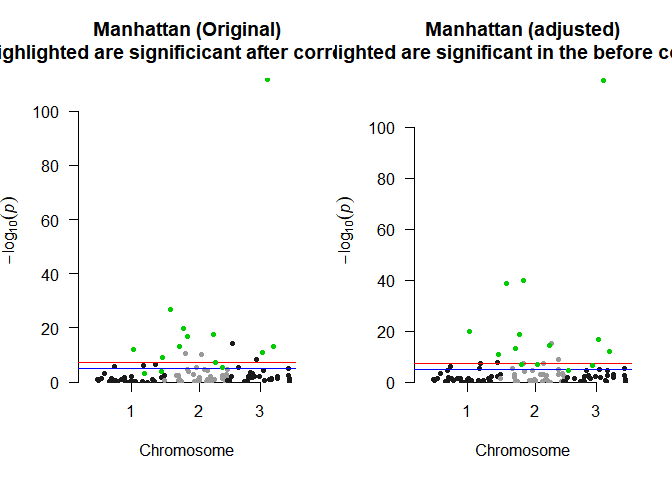

<!-- README.md is generated from README.Rmd. Please edit that file -->

# LOVAGWAS

<!-- badges: start -->
<!-- badges: end -->

The goal of LOVAGWAS is to adjust GWAS SNP marginal effect sizes to
estimate the direct genetic effect using the causal relationship between
the outcome and exposures estimated by Multivariable Mendelian
Randomization approach

## Installation

You can install the development version of LOVAGWAS from
[GitHub](https://github.com/) with:

``` r
# install.packages("pak")
pak::pak("lamessad/LOVAGWAS")
```

## Preparing Input Data

Before applying **`LOVAGWAS`**, all GWAS summary statistics (exposures
and outcome) must be:

**1. Harmonized to the same reference panel (e.g., 1000 Genomes EUR)**,

**2. Restricted to common SNPs across all datasets.**

Step 1. Harmonize each summary statistics

``` r
### -----------------------------------------
# # Clear workspace
### -----------------------------------------
# rm(list = ls())
### -----------------------------------------
#
### -----------------------------------------
# # 1. Read GWAS summary data
### -----------------------------------------
# data <- read.table("bmi_summary.txt", header = TRUE)
#
### -----------------------------------------
# # 2. Read reference panel (1000G EUR BIM file)
### -----------------------------------------
# bim <- read.table("/data/alh-admlda/reference/EUR.bim", header = FALSE)
# colnames(bim) <- c("CHR","SNP","cM","BP","A1","A2")
#
### -----------------------------------------
# # 3. Standardize GWAS column names
### -----------------------------------------
# colnames(data) <- c("CHR","BP","SNP","A1","A2","b","se","lp","N","AF")
#
### -----------------------------------------
# # 4. Keep SNPs present in both GWAS and reference
### -----------------------------------------
# commonsnps <- intersect(bim$SNP, data$SNP)
# data <- data[match(commonsnps, data$SNP), ]
# bim  <- bim[match(commonsnps, bim$SNP), ]
#
### -----------------------------------------
# # 5. Check allele alignment
### -----------------------------------------
# allele_ind <- (data$A1 == bim$A1 & data$A2 == bim$A2) |
#               (data$A2 == bim$A1 & data$A1 == bim$A2)
# data <- data[allele_ind, ]
# bim  <- bim[allele_ind, ]
#
### -----------------------------------------
# # 6. Align effect alleles to reference
### -----------------------------------------
# flip <- data$A1 == bim$A2
# data$b[flip] <- -data$b[flip]
# data$A1 <- bim$A1
# data$A2 <- bim$A2
# 
### -----------------------------------------
# # 7. Save harmonized file
# write.table(data, file = "bmi_harmonized.txt", quote = FALSE, -->
#             sep = "\t", row.names = FALSE)
```

Repeat these steps for all exposures and the outcome

Step 2 – Extract and align SNP effect Sizes across GWAS

``` r
# ## -----------------------------------------
# ## Files
# ## -----------------------------------------
# #Exposure
# betaX_files <- c("tg_harmonized.txt", "ldl_harmonized.txt",
#                  "hdl_harmonized.txt", "bmi_harmonized.txt",
#                  "ht_harmonized.txt", "fg_harmonized.txt",
#                  "sbp_harmonized.txt", "dbp_harmonized.txt")
# # Outcome
# betaY_file <- "cad_harmonized.txt"
# 
# ## -----------------------------------------
# ## Outcome (CAD): keep CAD SNP order
# ## -----------------------------------------
# cad <- read.table(betaY_file, header = TRUE, stringsAsFactors = FALSE)
# cad$SNP <- as.character(cad$SNP)
# 
# betaY   <- cad[, c("SNP", "b", "se")]
# ## -----------------------------------------
# ## Exposures: fill by CAD order (no merges)
# ## -----------------------------------------
# betaX   <- data.frame(SNP = cad$SNP, stringsAsFactors = FALSE)
# 
# for (f in betaX_files) {
#   gwas <- read.table(f, header = TRUE, stringsAsFactors = FALSE)
#   gwas$SNP <- as.character(gwas$SNP)
#   
#   ## (optional) drop duplicate SNPs if present (keeps first)
#   if (any(duplicated(gwas$SNP))) gwas <- gwas[!duplicated(gwas$SNP), ]
#   
#   exposure <- sub("_harmonized\\.txt$", "", basename(f))
#   
#   m <- match(betaX$SNP, gwas$SNP)  # indices in GWAS rows that match CAD order
#   
#   betaX[[paste0("beta_", exposure)]] <- gwas$b[m]
#   
# }

```

Step 3. Apply LOVA-GWAS adjustment

``` r
# tau_t <- c(0.1, 0.2)  # causal estimates from MVMR-LOVA or prior MR step
# ny <- 547261            # outcome GWAS sample size
# tau_t <- c(0.01, 0.24, -0.34, 0.26, -0.08, 0.35, 0.02, 0.03)
# res_lova <- lova_gwas(
#   gwasY = gwasY,
#   betaX = betaX,
#   tau_t = tau_t,
#   ny = ny,
#   plot_manhattan = TRUE,
#   save_path = "plots/lova_manhattan.png"
# )
# 
# head(res_lova)
```

## Example

Here is an example demonstrating how to apply LOVAGWAS methods to
estimate direct genetic effect of a SNP.

``` r
library(LOVAGWAS)
## load the example data created by simulation 
data(gwasY)
data(betaX)
head(gwasY) 
#>   SNP CHR      BP A1 A2        BETA         SE
#> 1 rs1   4 1933158  C  A  0.00909511 0.02804475
#> 2 rs2   7 1506548  A  G  0.06592005 0.02102528
#> 3 rs3   1 1732373  T  C -0.01494547 0.01257129
#> 4 rs4   2 1465632  A  T -0.08241109 0.01884020
#> 5 rs5  11 1171353  T  T  0.04757492 0.01384595
#> 6 rs6  14 1152618  G  G -0.05565615 0.01869801
head(betaX) 
#>   SNP        exp1         exp2
#> 1 rs1  0.03264762  0.004374846
#> 2 rs2  0.10306709  0.065935057
#> 3 rs3 -0.08983225           NA
#> 4 rs4  0.02920386 -0.012281129
#> 5 rs5          NA -0.070196692
#> 6 rs6 -0.03145823  0.072044657
tau_t <- c(0.1, 0.2) 
res <- lova_gwas(gwasY, betaX = betaX, tau_t = tau_t, ny = 50000, #outcome GWAS sample size
    plot_manhattan = TRUE
  )
```



``` r
head(res)
#>   SNP CHR      BP A1 A2           b         se         pval          b_c
#> 1 rs1   4 1933158  C  A  0.00909511 0.02804475 7.457056e-01  0.004955379
#> 2 rs2   7 1506548  A  G  0.06592005 0.02102528 1.716927e-03  0.042426326
#> 3 rs3   1 1732373  T  C -0.01494547 0.01257129 2.344961e-01 -0.005962241
#> 4 rs4   2 1465632  A  T -0.08241109 0.01884020 1.218696e-05 -0.082875247
#> 5 rs5  11 1171353  T  T  0.04757492 0.01384595 5.903354e-04  0.061614262
#> 6 rs6  14 1152618  G  G -0.05565615 0.01869801 2.914821e-03 -0.066919256
#>         se_c        z_c       pval_c missing_count missing_index
#> 1 0.02805491  0.1766314 8.597979e-01             0          <NA>
#> 2 0.02103883  2.0165727 4.374012e-02             0          <NA>
#> 3 0.01259394 -0.4734214 6.359126e-01             1             2
#> 4 0.01885531 -4.3953256 1.106068e-05             0          <NA>
#> 5 0.01386652  4.4433835 8.855513e-06             1             1
#> 6 0.01871325 -3.5760367 3.488426e-04             0          <NA>
```

## Contact

Please contact Lamessa Amente (<lamessa.amente@mymail.unisa.edu.au>) or
Hong Lee (<hong.lee@unisa.edu.au>) if you have any queries.
